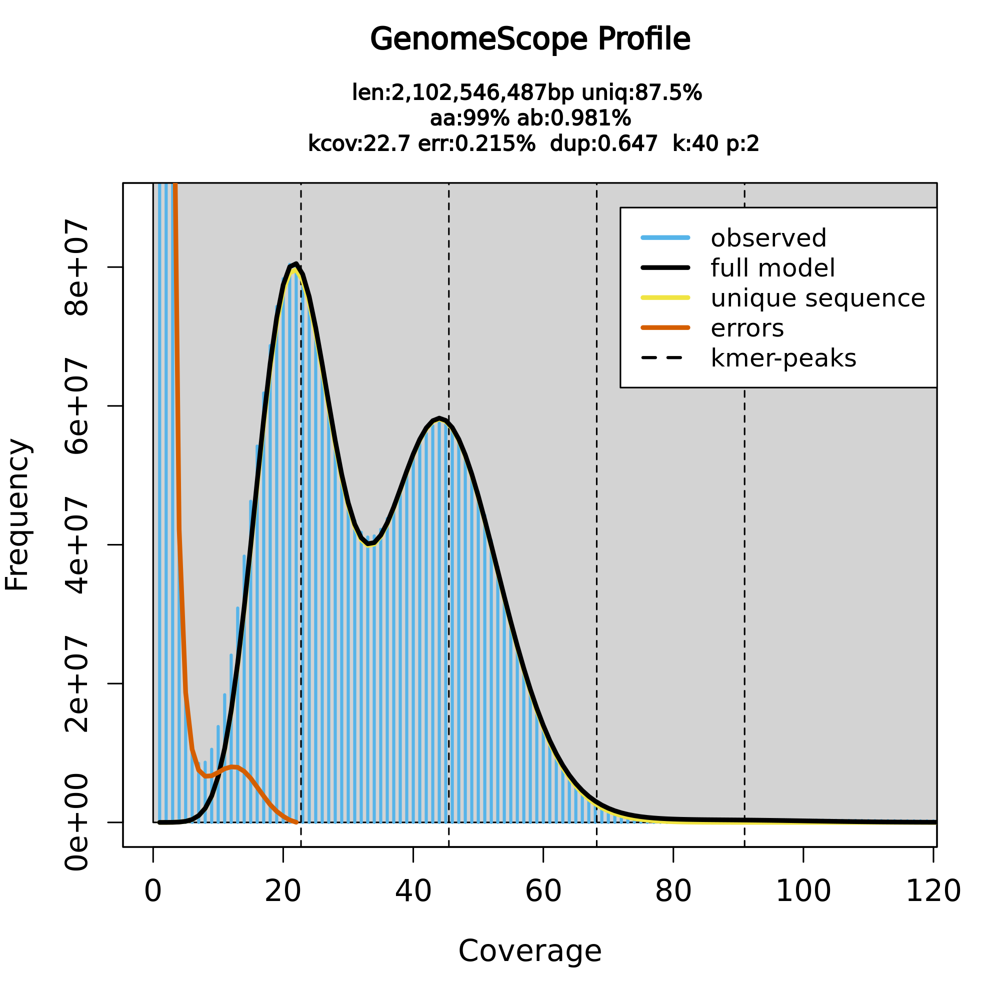
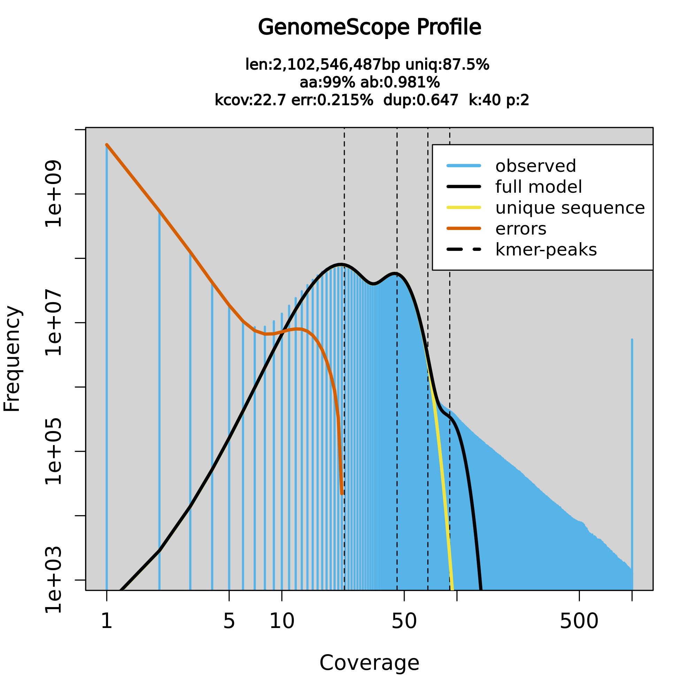
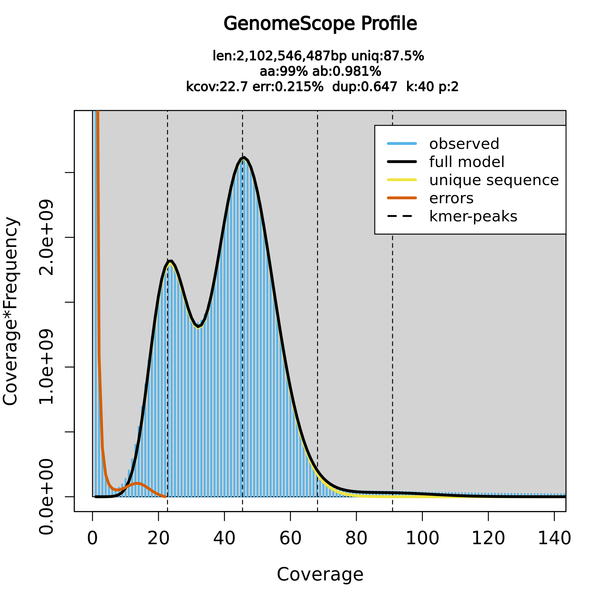
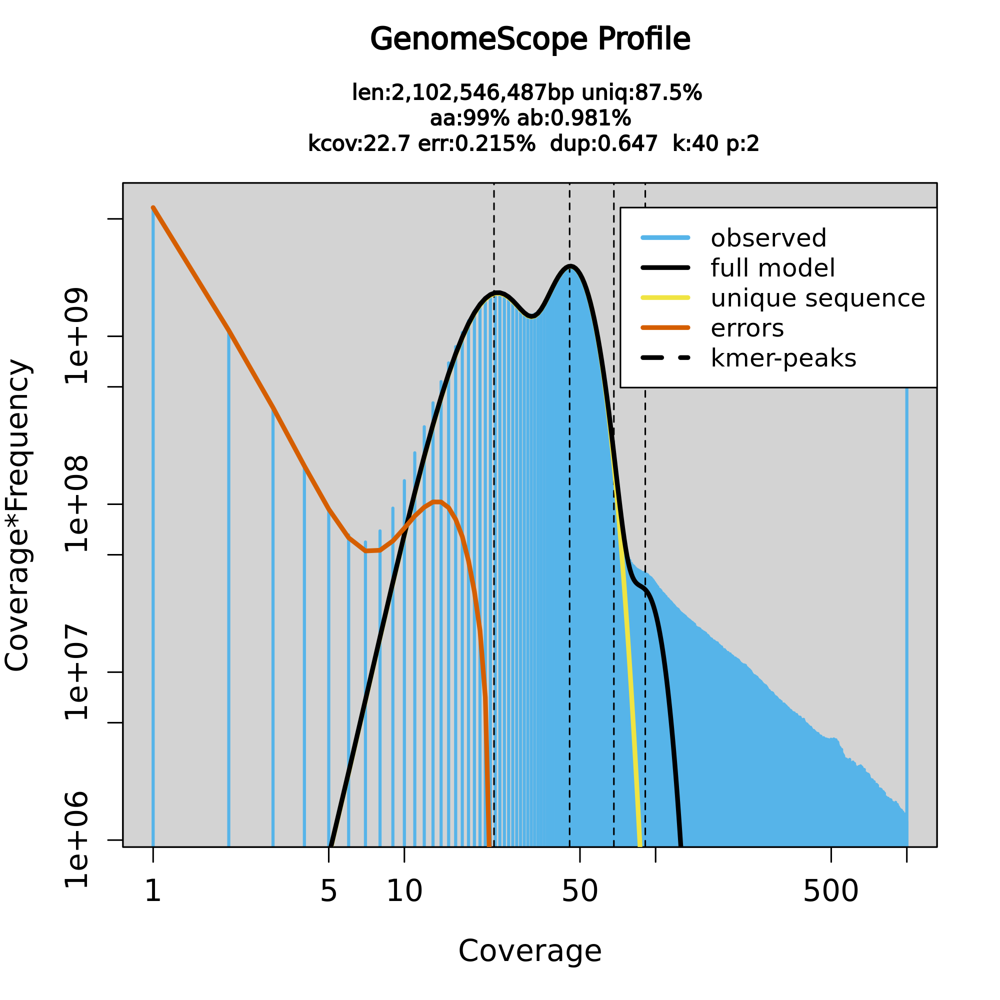

# Run GeneScopeFK on the FastK kmer table 

```bash 
# 1. store singularity command (with all arguments) into a variable to facilitate the command line call
SING_CMD="singularity exec --no-home --cleanenv -B /projects /projects/dazzler/pippel/prog/assembly-workshop/assembly-workshop_v0.6.3.sif"
```

We first need to create a histogram from the previously created kmer tables. This can be done 
with `Histex` a command line tool from the FastK package. It is important to set `-G` option so that so that GeneScope.FK outputs a correct estimate of genome size and % repetitiveness.

**!NOTE!** It is important that the file `mTadBra1.hist` that was created in the FastK step will not be overwritten with output from Histex. 

We will store the first 1000 frequencies `-h1000` in a new text file `mTadBra1.hist.txt`. For larger genomes (>3Gb) the number of frequencies might need to be increased. 

```bash 
${SING_CMD} Histex -G mTadBra1 -h1000 > mTadBra1.hist.txt

cat head mTadBra1.hist.txt
#1 5838183588
#2 541713593
#3 125418790
#4 42281846
#5 18859720
#6 10944284
#7 8507058
#8 8671607
#9 10529683
#10 13812800
```
Afterwards we can use this histrogram text file in GeneScopeFK. 
To get an overview about the GeneScopeFK arguments just run `${SING_CMD} GeneScopeFK.R --help` on the command line. A more in depth introduction into GeneScopeFK.R can be found on Gene Myer's github repo [GeneScopeFK](https://github.com/thegenemyers/GeneScope.FK).

```
usage: /usr/local/bin/GeneScopeFK.R [-h] [-v] [-i INPUT] [-o OUTPUT]
                                    [-p PLOIDY] [-k KMER_LENGTH]
                                    [-n NAME_PREFIX] [-l LAMBDA]
                                    [-m MAX_KMERCOV] [--verbose]
                                    [--no_unique_sequence] [-t TOPOLOGY]
                                    [--initial_repetitiveness INITIAL_REPETITIVENESS]
                                    [--initial_heterozygosities INITIAL_HETEROZYGOSITIES]
                                    [--transform_exp TRANSFORM_EXP]
                                    [--testing] [--true_params TRUE_PARAMS]
                                    [--trace_flag] [--num_rounds NUM_ROUNDS]

optional arguments:
  -h, --help            show this help message and exit
  -v, --version         print the version and exit
  -i INPUT, --input INPUT
                        input histogram file
  -o OUTPUT, --output OUTPUT
                        output directory name
  -p PLOIDY, --ploidy PLOIDY
                        ploidy (1, 2, 3, 4, 5, or 6) for model to use [default
                        2]
  -k KMER_LENGTH, --kmer_length KMER_LENGTH
                        kmer length used to calculate kmer spectra [default
                        21]
  -n NAME_PREFIX, --name_prefix NAME_PREFIX
                        optional name_prefix for output files
  -l LAMBDA, --lambda LAMBDA, --kcov LAMBDA, --kmercov LAMBDA
                        optional initial kmercov estimate for model to use
-m MAX_KMERCOV, --max_kmercov MAX_KMERCOV
                        optional maximum kmer coverage threshold (kmers with
                        coverage greater than max_kmercov are ignored by the
                        model)  
  --verbose             optional flag to print messages during execution
  --no_unique_sequence  optional flag to turn off yellow unique sequence line
                        in plots
  -t TOPOLOGY, --topology TOPOLOGY
                        ADVANCED: flag for topology for model to use
  --initial_repetitiveness INITIAL_REPETITIVENESS
                        ADVANCED: flag to set initial value for repetitiveness
  --initial_heterozygosities INITIAL_HETEROZYGOSITIES
                        ADVANCED: flag to set initial values for nucleotide
                        heterozygosity rates
  --transform_exp TRANSFORM_EXP 
                        ADVANCED: parameter for the exponent when fitting a
                        transformed (x**transform_exp*y vs. x) kmer histogram
                        [default 1]
  --testing             ADVANCED: flag to create testing.tsv file with model
                        parameters
  --true_params TRUE_PARAMS
                        ADVANCED: flag to state true simulated parameters for
                        testing mode
  --trace_flag          ADVANCED: flag to turn on printing of iteration
                        progress of nlsLM function
  --num_rounds NUM_ROUNDS
                        ADVANCED: parameter for the number of optimization
                        rounds  
```

In our test scenario we will use the arguments `-i mTadBra1.hist.txt -o genescopeFK -k 40`. The results will b written into a sub directory `genescopeFK` and the kmer length is set to 40 `-k 40`, which needs be the same that was used in the FastK call [README_FastK](./README_FastK.md). 

```bash 
${SING_CMD} GeneScopeFK.R -i mTadBra1.hist.txt -o genescopeFK -k40
```

GeneScopeFK.R created the following files: 
```
model.txt  
progress.txt  
summary.txt  
linear_plot.png  
log_plot.png  
transformed_linear_plot.png  
transformed_log_plot.png
```

A look into the summary.txt file:
```bash 
GenomeScope version 2.0
input file = mTadBra1.hist.txt
output directory = genescopeFK/
p = 2
k = 40

property                      min               max               
Homozygous (aa)               99.0153%          99.0223%          
Heterozygous (ab)             0.97765%          0.984683%         
Genome Haploid Length         NA bp             2,102,546,487 bp  
Genome Repeat Length          264,272,784 bp    264,567,375 bp    
Genome Unique Length          1,837,103,130 bp  1,839,150,990 bp  
Model Fit                     92.5427%          98.1712%          
Read Error Rate               0.214868%         0.214868%    
```

A look into the figures file:









back to [main QC page](./README.md)