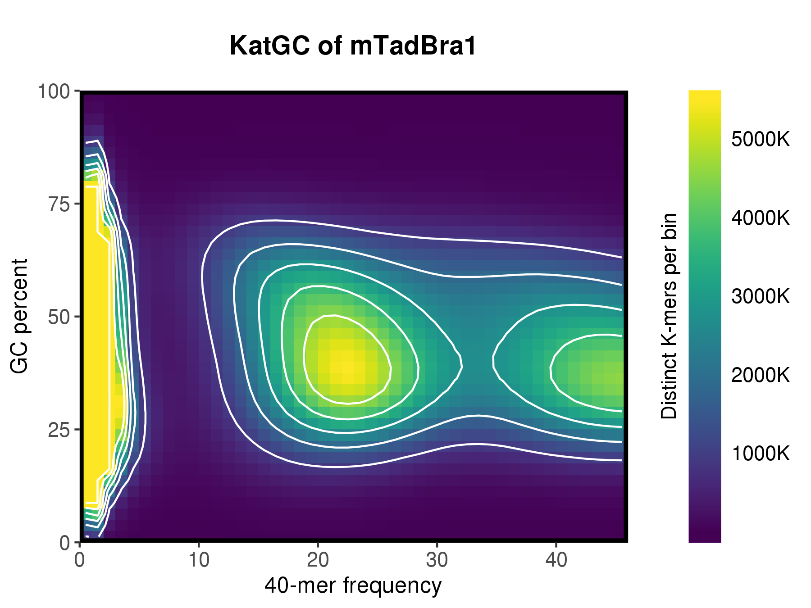
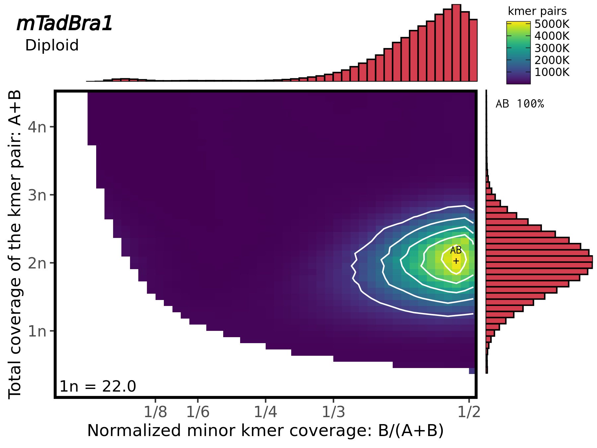

# Run MerquryFK on the FastK kmer table 

The MerquryFK package contains further useful tool for an initial read anlysis.

## [KatGC](https://github.com/thegenemyers/MERQURY.FK#KatGC)

KatGC produces a 3D heat map or contour map of the frequency of a k-mer versus its' GC content

```bash 
# 1. store singularity command (with all arguments) into a variable to facilitate the command line call
SING_CMD="singularity exec --no-home --cleanenv -B /projects /projects/dazzler/pippel/prog/assembly-workshop/assembly-workshop_v0.6.3.sif"
# 2. run KatGC with 8 threads (! no space between -T8)
${SING_CMD} KatGC -T8 mTadBra1_KatGC
``` 
KatGC will produce by default 3 images `mTadBra1_KatGC.ln.png, mTadBra1_KatGC.fi.png, mTadBra1_KatGC.st.png)`, where `ln` is the 
contour line plot of count iso-lines, `fi`  represents the filled heat map of the counts, and `st` stacked heap map plus contour plot.



## [PloidyPlot](https://github.com/thegenemyers/MERQURY.FK#PloidyPlot)

PloidyPlot is pretty useful in case the ploidy of your sample is unknown.

```bash 
# 1. store singularity command (with all arguments) into a variable to facilitate the command line call
SING_CMD="singularity exec --no-home --cleanenv -B /projects /projects/dazzler/pippel/prog/assembly-workshop/assembly-workshop_v0.6.3.sif"
# 2. run PloidyPlot with 12 threads (! no space between -T12)
${SING_CMD} PloidyPlot -T12 -v -o$(pwd) mTadBra1
``` 
 


back to [main QC page](./README.md)
