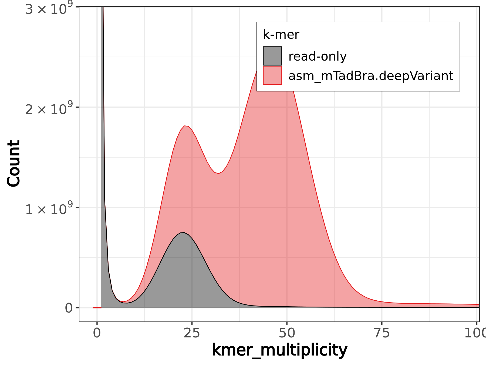
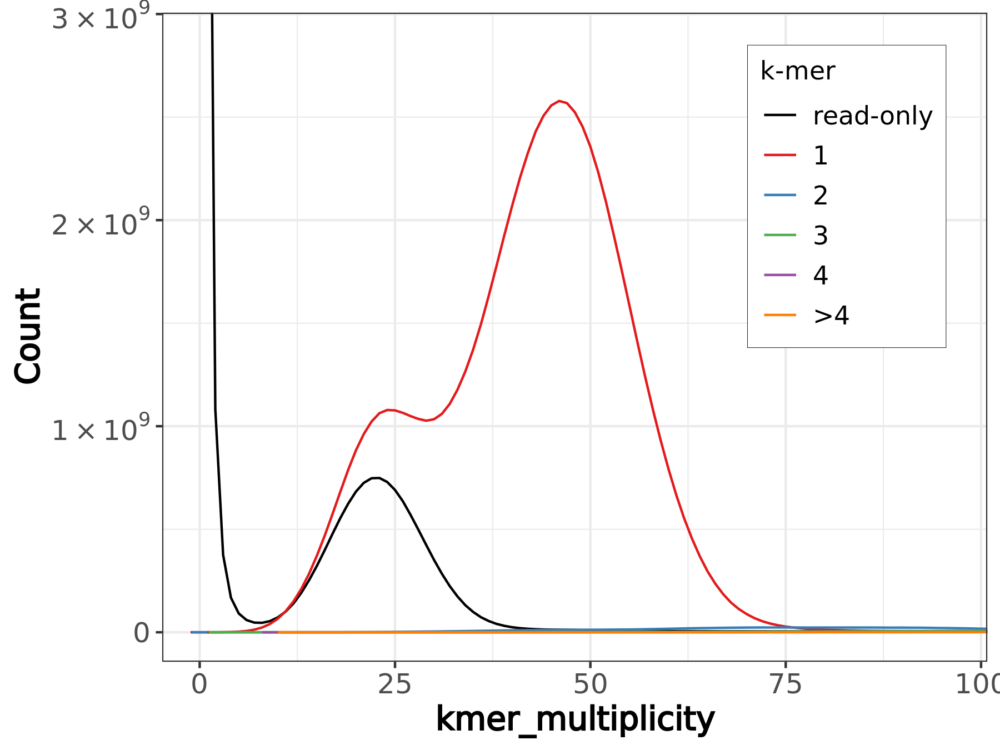

# evaluate the quality of your assembly with MerquryFK 

To evaluate the quality of your assembled genome we recommend to use the tool MerquryFK from the [MerquryFK](https://github.com/thegenemyers/MERQURY.FK#MerquryFK) package. You can reuse the FastK kmer tables from the CCS reads that were used in the initial QC. But if any further data set is available for you, e.g. plain Illumina reads, or 10X Illumina linked reads, we recommend to use this.


```bash 
# 1. store singularity command (with all arguments) into a variable to facilitate the command line call
SING_CMD="singularity exec --no-home --cleanenv -B /projects /projects/dazzler/pippel/prog/assembly-workshop/assembly-workshop_v0.6.3.sif"
```

To show the available options, just run  `${SING_CMD} MerquryFK` on the command line:

```
Usage: MerquryFK  [-v] [-lfs] [-pdf] [-T<int(4)>]
                  <read>[.ktab] [ <mat>[.hap[.ktab]] <pat>[.hap[.ktab]] ]
                  <asm1:dna> [<asm2:dna>] <out>

      -v: verbose output to stderr
      -T: number of threads to use

      -l: draw line plot
      -f: draw fill plot
      -s: draw stack plot
          any combo allowed, none => draw all

    -pdf: output .pdf (default is .png)
```

```bash
# 2. run Merquery with 8 threads (! no space between -T8), in verbose mode -v
${SING_CMD} MerquryFK -v -T8 mTadBra1 asm_mTadBra.deepVariant.fasta mTadBra_MerquryFK
``` 

The command creates several files:

```bash 
mTadBra_MerquryFK.qv
mTadBra_MerquryFK.asm_mTadBra.deepVariant.qv
mTadBra_MerquryFK.asm_mTadBra.deepVariant_only.bed
mTadBra_MerquryFK.completeness.stats
mTadBra_MerquryFK.asm_mTadBra.deepVariant.spectra-cn.fl.png
mTadBra_MerquryFK.asm_mTadBra.deepVariant.spectra-cn.ln.png
mTadBra_MerquryFK.asm_mTadBra.deepVariant.spectra-cn.st.png
mTadBra_MerquryFK.spectra-asm.fl.png
mTadBra_MerquryFK.spectra-asm.ln.png
mTadBra_MerquryFK.spectra-asm.st.png
```

```bash 
cat mTadBra_MerquryFK.qv
#Assembly        No Support      Total   Error % QV
#asm_mTadBra.deepVariant 57356   2258913538      0.0001  62.0
```

```bash 
head mTadBra_MerquryFK.asm_mTadBra.deepVariant.qv 
#Assembly Only   Total   Error % QV
#3827    132135934       0.0000  61.4
#1355    123979508       0.0000  65.6
#22181   244991028       0.0000  56.5
#1053    112596645       0.0000  66.3
#1329    112040493       0.0000  65.3
```




A complete description of all out stats can be found Gene Myers git repo [MerquryFK](https://github.com/thegenemyers/MERQURY.FK#MerquryFK).

back to [main page](../README.md)